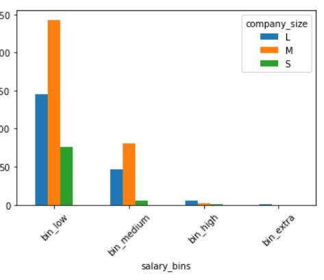

# Feature spaces, Linear Algebra, Numeric data methods, Linear Regression
#### Part 1
1. Feature space from csv file. Read `data/ds_salaries.csv` into a pandas dataframe
2. Prune the dataset to only have columns: "work_year", "experience_level", "salary_in_usd", "job_title", "company_location", "company_size".
3. Onehot encode "experience_level". Hint: look up pandas: `get_dummies()` method.
4. labelencode "company_location" 
5. Normalize the company_location number (relative value between 0-1) 
6. Make binning of the salary column (both cut and qcut methods).
7. Make a barplot with binned salaries to show the company size count for each of the bins. Like this: 



Hint: Use pandas Series unstack() method to get a dataframe from a multiindex Series object (The result of making a groupby count on both salary_bins and company_size columns

#### Part 2
8. Make it into a function that can take either company_size or experience_level as arguments.
9. Change the experience_level column to be numeric using this dictionary: `experience = {'EN':10, 'MI':20,'SE':30, 'EX':40}`. Hint: [Here](https://sparkbyexamples.com/pandas/pandas-remap-values-in-column-with-a-dictionary-dict/).
10. Use seaborn pairplot to see if there is an approximately linear relationship between experience_level and salary
11. scatter Plot the 2d feature space of 'experience_level' and 'salary_in_usd
12. Use sklearn to find the best possible linear relationship between experience_level and salary_in_usd using linear regression.

## Part 3: Linear Algebra
Given the below dictionarys find out where each of the 4 people find the cheapest shopping according to their needs.
```python
shoppers = {
'Paula':{'Is':4,'Juice':2,'Kakao':3,'Lagkager':2},
'Peter':{'Is':2,'Juice':5,'Kakao':0, 'Lagkager':4},
'Pandora':{'Is':5,'Juice':3, 'Kakao':4, 'Lagkager':5},
'Pietro':{'Is':1,'Juice':8, 'Kakao':9, 'Lagkager':1}
}
shop_prices = {
    'Netto': {'Is':10.50,'Juice':2.25,'Kakao':4.50,'Lagkager':33.50},
    'Fakta': {'Is':4.00,'Juice':4.50,'Kakao':6.25,'Lagkager':20.00}
}
```
Hint: you can use pandas and Transpose to create dataframe: `pd.DataFrame(shoppers).T` to get the necessary shape of the dataframe/matrix. Also use df.to_numpy() to changes a Pandas DataFrame df into a numpy ndarray with only the numeric data
